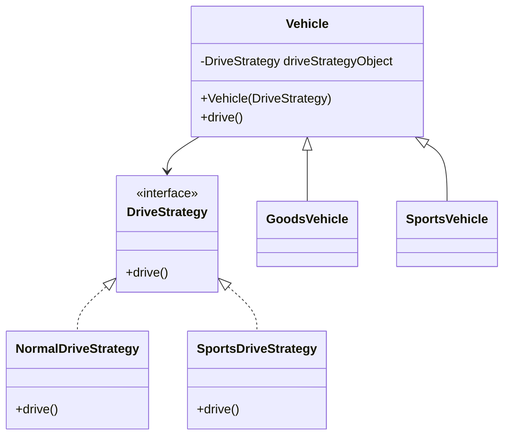
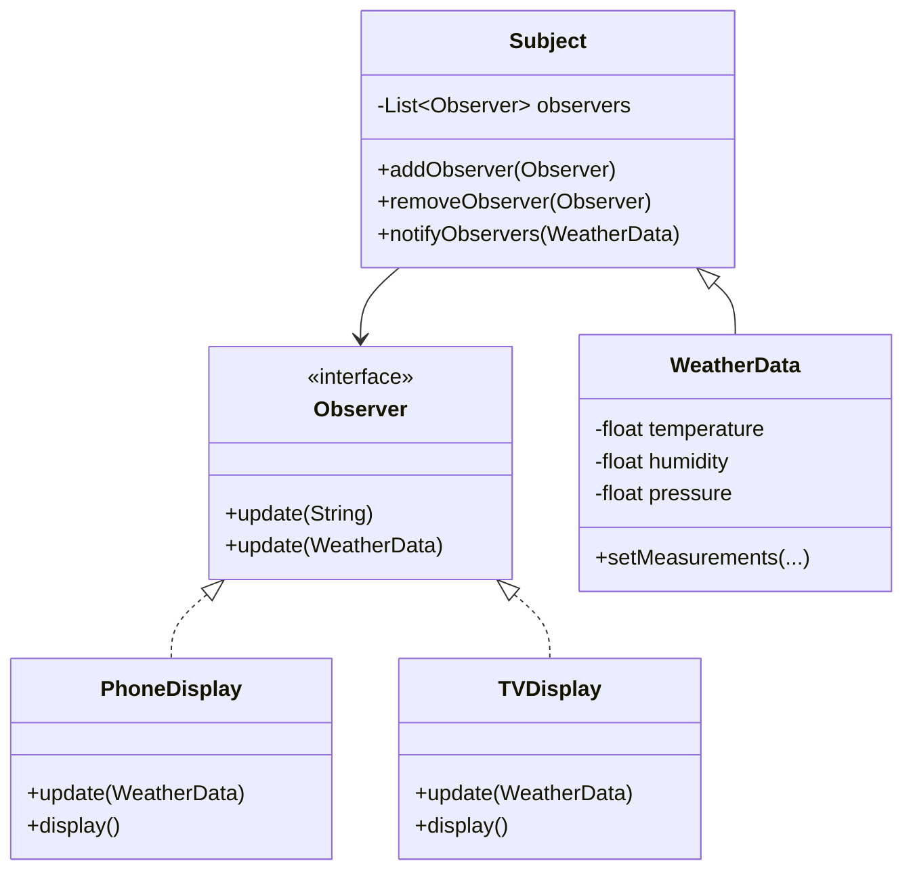
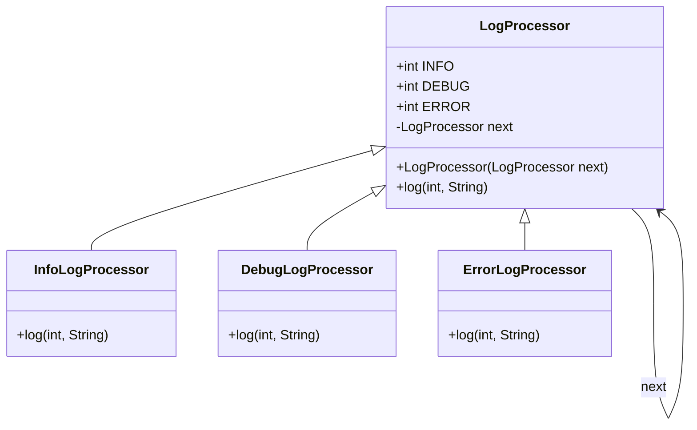
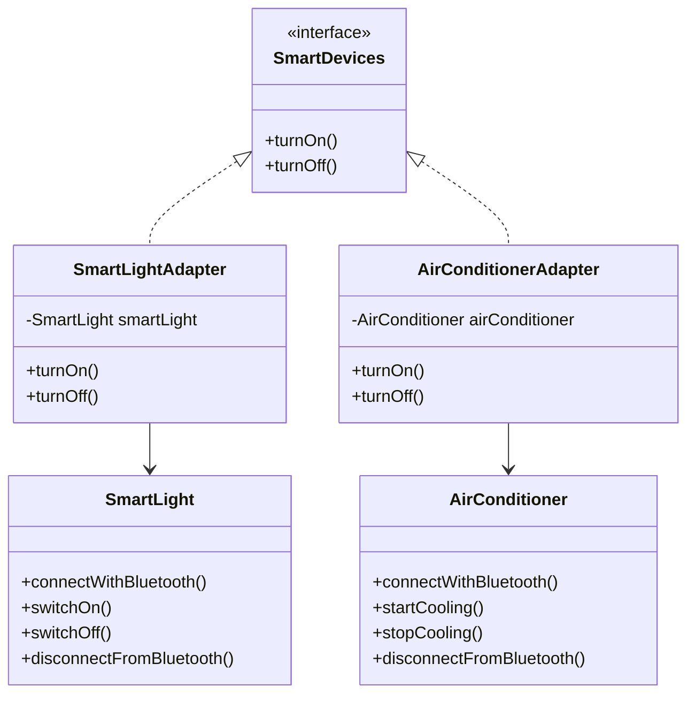
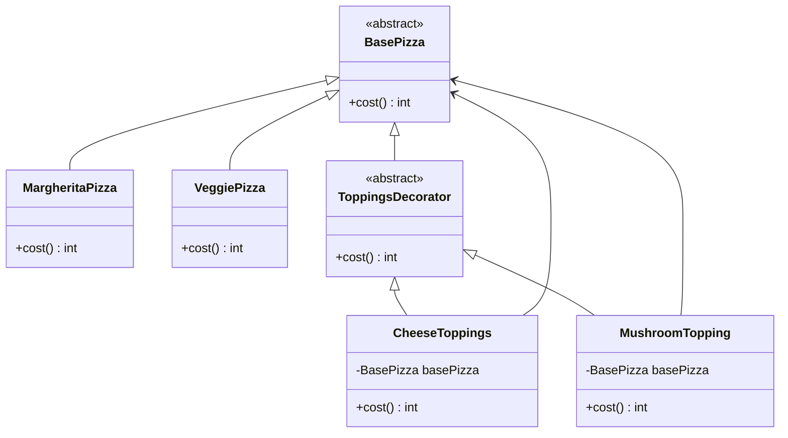
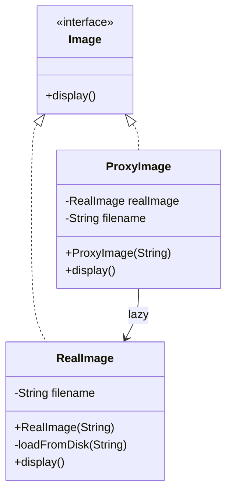
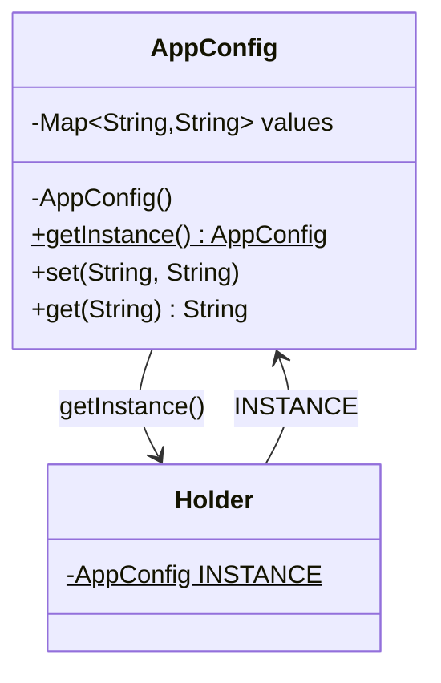
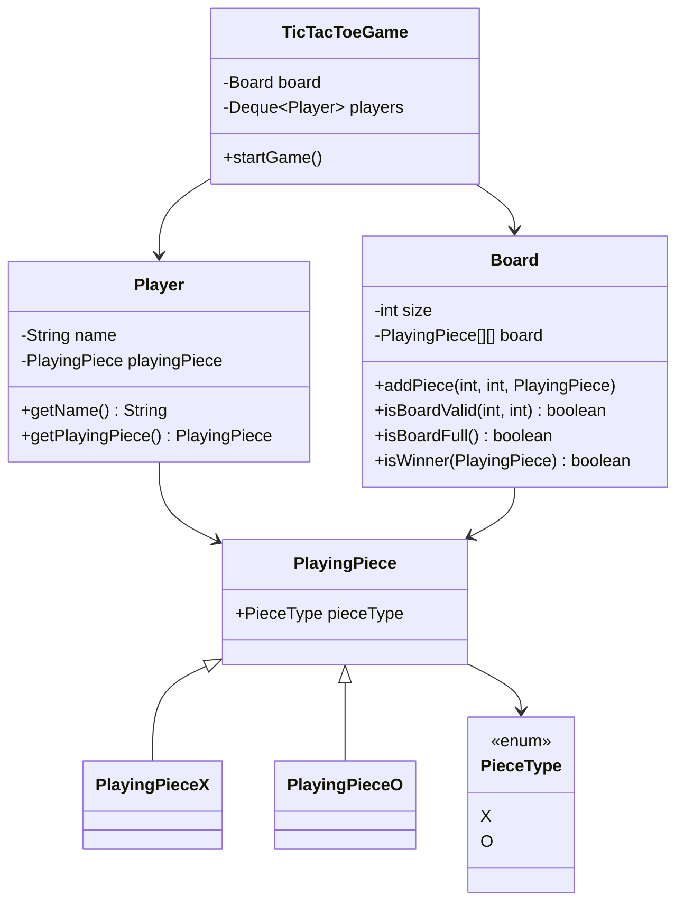

# Low Level Design (LLD) — Java Notes

Concepts, design-pattern notes, and learnings collected while practicing Low
Level Design in Java.

## How patterns are organized

Design patterns live as **Java packages** under the three classic GoF
categories, each pattern in its own sub-package so the code stays isolated:

- `com.lld.creational.*` — how objects are created.
- `com.lld.structural.*` — how objects are composed into larger structures.
- `com.lld.behavioral.*` — how objects communicate and share responsibility.

---

## Patterns implemented

### Strategy (behavioral) — `com.lld.behavioral.StrategyPattern`
- **Idea:** Define a family of interchangeable algorithms behind a common
  interface and let a class delegate to one at runtime (favor **composition
  over inheritance**).
- **Here:** `DriveStrategy` (interface) → `NormalDriveStrategy`,
  `SportsDriveStrategy`. A `Vehicle` *holds a* `DriveStrategy` and calls
  `driveStrategyObject.drive()`. `GoodsVehicle`/`SportsVehicle` pick a strategy.
- **Why it beats inheritance:** without Strategy, every new vehicle type that
  shares behavior forces you to duplicate/override methods. Strategy swaps
  behavior by plugging in a different object.

### Observer (behavioral) — `com.lld.behavioral.ObserverPattern`
- **Idea:** Define a one-to-many dependency so that when one object (the
  *subject*) changes state, all its dependents (*observers*) are notified
  automatically — without the subject knowing their concrete types.
- **Here:** `Subject` keeps a `List<Observer>` (`addObserver`/`removeObserver`/
  `notifyObservers`). `WeatherData extends Subject`; its `setMeasurements(...)`
  calls `notifyObservers(this)`. `Observer` implementations `PhoneDisplay` and
  `TVDisplay` register themselves in their constructor (`addObserver(this)`) and,
  on `update(WeatherData)`, pull the latest values and re-`display()`.
- **Key move:** observers **register** with the subject and the subject only
  depends on the `Observer` interface — so new displays can be added without
  touching `WeatherData`.

### Chain of Responsibility (behavioral) — `com.lld.behavioral.ChainOfResponsibility`
- **Idea:** Pass a request along a chain of handlers; each handler either
  processes it or forwards it to the next, so the sender is decoupled from
  whoever ultimately handles it.
- **Here:** `LogProcessor` (base) holds a `next` reference and its `log(level,
  msg)` forwards to `next`. `InfoLogProcessor`, `DebugLogProcessor`,
  `ErrorLogProcessor` each `extend` it, handle their own level, and call
  `super.log(...)` otherwise. The chain is built via constructors:
  `new InfoLogProcessor(new DebugLogProcessor(new ErrorLogProcessor(null)))`.
- **Key move:** wiring the successor **through the constructor** (`super(next)`)
  builds the chain at construction time — each handler only knows about its
  `next`, not the whole chain.

### Decorator (structural) — `com.lld.structural.DecoratorPattern`
- **Idea:** Attach responsibilities to an object dynamically by wrapping it.
  Both the concrete object and the wrappers share the same base type, so
  wrappers can be stacked endlessly.
- **Here:** abstract `BasePizza` (defines `cost()`) → concrete `MargheritaPizza`,
  `VeggiePizza`; abstract `ToppingsDecorator extends BasePizza` →
  `CheeseToppings`, `MushroomTopping`. Each topping *wraps a* `BasePizza` and
  adds to `cost()`. `new MushroomTopping(new CheeseToppings(new MargheritaPizza()))`
  → 100 + 10 + 15 = **125**.
- **Key move:** the decorator both **extends** the base type (so it *is-a*
  pizza) and **holds** one (so it can *wrap* a pizza).

### Adapter (structural) — `com.lld.structural.AdapterPattern`
- **Idea:** Let two incompatible interfaces work together by wrapping an
  existing class (the *adaptee*) in an adapter that exposes the interface the
  client expects — without changing either side.
- **Here:** `SmartDevices` (target interface, `turnOn()`/`turnOff()`) is what the
  client uses. `SmartLight` and `AirConditioner` are pre-existing *adaptees* with
  their own incompatible methods (`connectWithBluetooth()`, `switchOn()`,
  `startCooling()`, …). `SmartLightAdapter` and `AirConditionerAdapter`
  `implement SmartDevices`, *hold* an adaptee, and translate `turnOn()`/
  `turnOff()` into the right sequence of adaptee calls.
- **Key move:** the adapter **implements the target interface** and **delegates**
  to the wrapped object — so the client only talks to `SmartDevices` and never
  knows the concrete device's odd API.
- **Adapter vs Decorator/Proxy:** all wrap an object, but an adapter **changes
  the interface** to a different one the client wants; a decorator keeps the same
  interface and **adds behavior**; a proxy keeps the same interface and
  **controls access**.

### Proxy (structural) — `com.lld.structural.ProxyDesign`
- **Idea:** Provide a stand-in that implements the same interface as a real
  object and controls access to it — adding behavior like lazy loading, caching,
  access control, or logging without the client knowing.
- **Here:** `Image` (interface, `display()`) → `RealImage` (expensive:
  `loadFromDisk(...)` runs in its constructor) and `ProxyImage`. `ProxyImage`
  holds the filename and a lazy `RealImage` reference, creating it only on the
  first `display()` call and reusing it afterwards. So `Loading...` prints once
  even across multiple `display()` calls.
- **Key move:** because the proxy implements the same `Image` interface, the
  client can't tell it apart from the real object — the indirection is where the
  extra control lives.
- **Proxy vs Decorator:** same "wrap behind the interface" shape, but a proxy
  **controls access to** the object, while a decorator **adds responsibilities
  to** it.

### Singleton (creational) — `com.lld.creational.singleton`
- **Idea:** Guarantee a single instance with a global access point.
- **Here:** `AppConfig` uses the thread-safe *initialization-on-demand holder*
  idiom (`getInstance()` returns the one `Holder.INSTANCE`).

---

## Design problems

Larger "design a system" exercises (not a single GoF pattern, but practice at
splitting responsibilities across classes).

### Tic-Tac-Toe — `com.lld.behavioral.TicTacToe`
- **Problem:** Model a playable N×N Tic-Tac-Toe for two players with turn-taking,
  move validation, and win/draw detection.
- **Model:** `PieceType` (enum `X`/`O`) → `PlayingPiece` (holds a `PieceType`) with
  concrete `PlayingPieceX`/`PlayingPieceO`; `Player` (name + its piece); `Board`
  (the `PlayingPiece[][]` grid and all grid operations).
- **Controller:** `TicTacToeGame` owns the `Board` and the players, and runs the
  game loop.
- **Key design decisions & why:**
  - **Turn rotation with a queue** — players sit in an `ArrayDeque`; each turn
    `pollFirst()` takes the current player and `addLast()` re-queues them, so
    turns alternate without index bookkeeping. On an invalid move, `addFirst()`
    lets the *same* player retry.
  - **`Board` owns grid rules** — `isBoardValid` (bounds + emptiness),
    `isBoardFull`, and `isWinner` live on `Board`, keeping grid logic in one
    place (Single Responsibility). `TicTacToeGame` only orchestrates.
  - **Generalized win check** — `isWinner` scans every row, column, and both
    diagonals via a `lineMatches(type, startRow, startCol, dRow, dCol)` helper
    that walks a line in a direction, so it works for any board size, not just 3.
  - **Enums for piece type** — comparing `PieceType` values is safe and readable
    (no magic strings/ints).

---

## Class design (UML)

Mermaid class diagrams for each pattern/problem in this codebase. `<|--` =
inheritance/implementation ("is-a"), `-->` = association/composition ("has-a").

### Strategy — `com.lld.behavioral.StrategyPattern`

### Observer — `com.lld.behavioral.ObserverPattern`

### Chain of Responsibility — `com.lld.behavioral.ChainOfResponsibility`

### Adapter — `com.lld.structural.AdapterPattern`

### Decorator — `com.lld.structural.DecoratorPattern`

### Proxy — `com.lld.structural.ProxyDesign`

### Singleton — `com.lld.creational.singleton`

### Tic-Tac-Toe — `com.lld.behavioral.TicTacToe`

---

## Key learnings & gotchas

### Java packages & imports
- A class's `package` must match its folder path under `src/main/java`.
- **A sub-package is a *different* package.** `...DecoratorPattern.Decorator` is
  NOT automatically visible to `...DecoratorPattern`, and vice versa. You must
  `import` across every package boundary (this caused repeated
  `cannot find symbol` errors). Classes in the *same* package need no import.
- A broken parent class causes **cascading errors** in children — e.g. when
  `ToppingsDecorator extends BasePizza` failed to compile, the compiler also
  reported "CheeseToppings cannot be converted to BasePizza". Fix the root
  (missing import) and the downstream errors disappear.

### `abstract` class vs normal class
- **Normal (concrete):** can be `new`-ed; all methods have bodies.
- **Abstract:** cannot be `new`-ed; may have abstract methods (no body) that
  subclasses must implement, but can *also* have fields, constructors, and
  concrete methods. Use it as a shared, incomplete base (e.g. `BasePizza`).
- **Interface vs abstract class:** interface = pure capability contract, no
  constructors/instance state (e.g. `DriveStrategy`). Abstract class = shared
  state/implementation + contract (e.g. `BasePizza`, `ToppingsDecorator`).

### `extends` vs `implements`
- `extends` — inherit from **one** class (its code + state); "is a kind of".
- `implements` — adopt **many** interfaces (only a contract); "can do".
- Implementing an interface means you must define **every** method it declares
  (all overloads too) or the class stays abstract → compile error.
- Example: `WeatherData extends Subject`; `PhoneDisplay implements Observer`.

### Observer wiring
- Observer only works if observers actually **register** with the subject
  (`addObserver(this)`) *and* the `update(...)` method **copies the new data**.
  Forgetting either makes the notifications silently do nothing.

### Naming convention
- Java classes start with an uppercase letter (`Main`, not `main`). It compiles
  either way, but uppercase is idiomatic.

---

## Design pattern cheat sheet

The three GoF categories:

- **Creational** — *how objects are created.* Singleton, Factory Method,
  Abstract Factory, Builder, Prototype.
- **Structural** — *how objects are composed into larger structures.* Adapter,
  Bridge, Composite, Decorator, Facade, Flyweight, Proxy.
- **Behavioral** — *how objects communicate/share responsibility.* Strategy,
  Observer, Command, State, Template Method, Iterator, Chain of Responsibility,
  Mediator, Memento, Visitor, Interpreter.

Guiding principles worth keeping in mind (SOLID):
- **S**ingle Responsibility · **O**pen/Closed · **L**iskov Substitution ·
  **I**nterface Segregation · **D**ependency Inversion.
- Recurring themes: *favor composition over inheritance*, *program to an
  interface, not an implementation*, *encapsulate what varies*.
